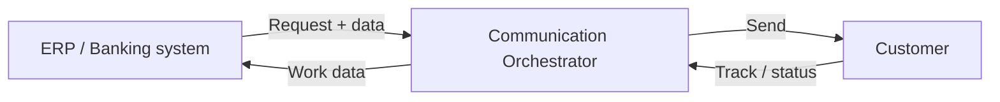
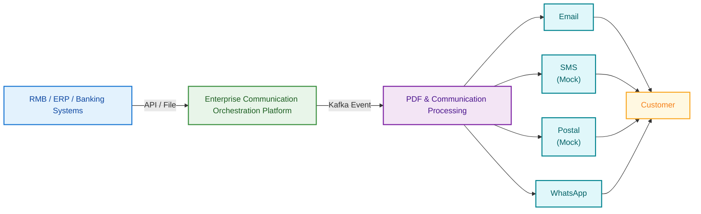
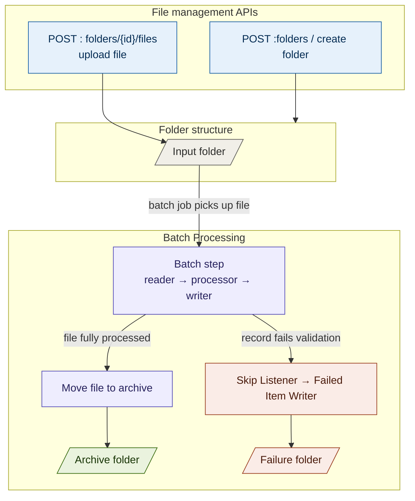
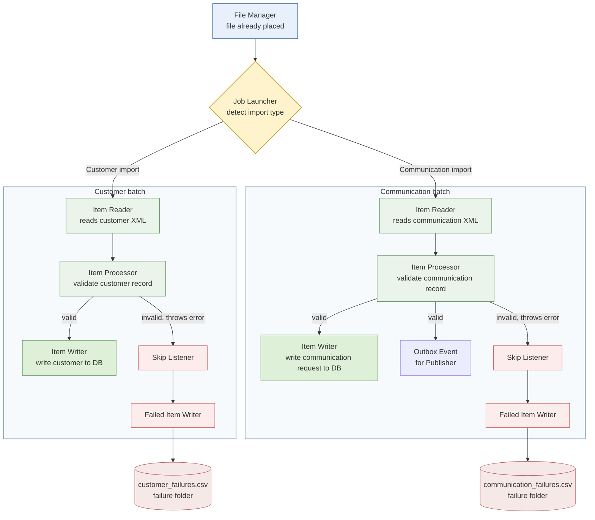
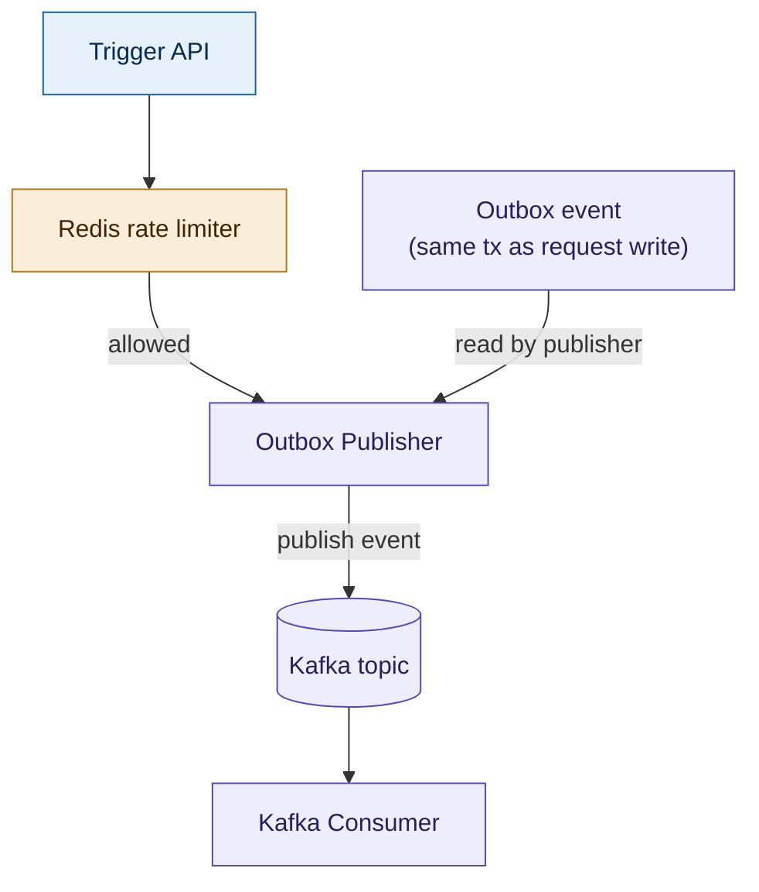
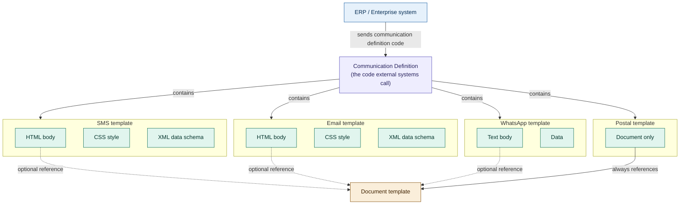
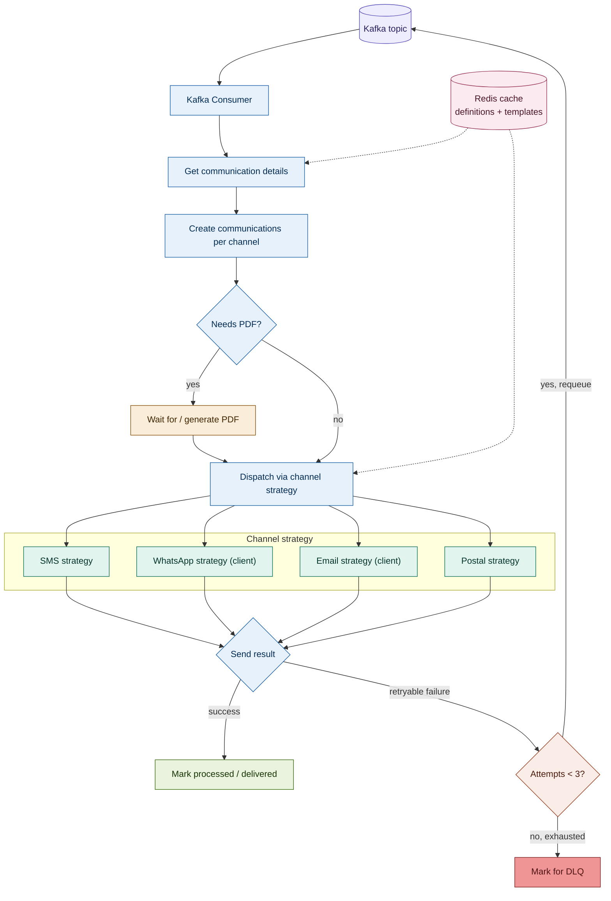

# Enterprise Communication Orchestration Platform

A middleware platform that sits between ERP / banking / core systems and end customers, resolving a single communication request into the right document, the right channel(s), and reliable delivery — with retries, a dead-letter queue, and full audit trail.

An external system (ERP, core banking, CRM) sends one call — a customer ID plus an XML payload keyed to a communication definition code — and the platform figures out what document to render, which channels to send it on (SMS, email, WhatsApp, postal), and tracks delivery all the way through, retrying failures and parking anything that can't be delivered after repeated attempts.

---

## Table of contents

1. [Basic idea](#1-basic-idea)
2. [End-to-end architecture](#2-end-to-end-architecture)
3. [Data ingestion](#3-data-ingestion)
   - [3.1 File management](#31-file-management)
   - [3.2 Batch processing (customer & communication import)](#32-batch-processing-customer--communication-import)
4. [Publishing pipeline (outbox → Kafka)](#4-publishing-pipeline-outbox--kafka)
5. [Templates & communication definitions](#5-templates--communication-definitions)
6. [Consumer processing, dispatch, and retries](#6-consumer-processing-dispatch-and-retries)
7. [API reference](#7-api-reference)
8. [Database schema](#8-database-schema)

---

## 1. Basic idea

At its simplest, the platform is a broker between a source system and a customer: the source system sends a request with the data it wants communicated, the orchestrator figures out how to turn that into an actual message, and reports status back.

## 2. End-to-end architecture

The complete flow, from a source system's API/file submission through to delivery on the customer's preferred channel.

The rest of this document breaks that single arrow-diagram into its real subsystems.

---

## 3. Data ingestion

Data enters the platform two ways: a direct REST call (`POST /api/v1/communication-requests` or `POST /api/v1/customers`), or a **file drop + batch job**. The batch path is the one with the most moving parts, so it's covered in detail below.

### 3.1 File management

Files are uploaded into folders via the file management APIs, picked up by a batch job, and — depending on outcome — either archived or partially routed to a failure folder.

### 3.2 Batch processing (customer & communication import)

Both import types share the same Spring Batch shape — a file reader that parses XML into an object, a processor that validates it, and a writer that commits it — with a skip listener catching any validation error and routing the failed record to a CSV in the failure folder instead of failing the whole job.

The communication XML follows a fixed shape: a `Communication` node wrapping the customer ID, and inside it a `CommunicationData` node carrying the communication definition code plus whatever fields the target templates need.

---

## 4. Publishing pipeline (outbox → Kafka)

Every communication request write goes hand-in-hand with an **outbox event**, written in the *same database transaction* — so an event is never published for a write that got rolled back. A publisher process sweeps the outbox table on a schedule (every 5 seconds) and pushes new events onto a Kafka topic; a manual **trigger API**, protected by a Redis-backed rate limiter, can also force a publish cycle on demand.

---

## 5. Templates & communication definitions

A **communication definition** is the code an external system actually calls — it bundles together the SMS, email, WhatsApp, and postal templates that should fire for that definition. Each channel template can optionally reference a **document template** (the reusable, PDF-producing artifact); postal is the one channel that *always* references a document template, since it has no body of its own.

Definitions and their templates are looked up frequently — once per Kafka event, per channel — so both the definition/document template and the individual channel templates are served from a **Redis cache** rather than hitting the DB on every message.

---

## 6. Consumer processing, dispatch, and retries

Once the Kafka consumer picks up an event, it resolves the communication definition (from cache), creates one communication record per applicable channel, waits on PDF generation where needed, then dispatches through a per-channel strategy (SMS, WhatsApp, email, postal — WhatsApp and email each go through their own client). Retryable failures requeue back onto the Kafka topic; after **3 failed attempts**, the record is marked for the dead-letter queue instead of retrying again.

DLQ'd events aren't a dead end — they're visible and actionable through `GET /api/v1/dlq` and can be retried or dismissed via `POST /api/v1/dlq/{id}/retry` / `/ignore` (see [API reference](#7-api-reference)).

---

## 7. API reference

All endpoints are under `/api/v1` unless noted. Authentication is JWT bearer, obtained via the auth endpoints.

### Auth

| Method | Path | Description |
|---|---|---|
| POST | `/auth/login` | Authenticate with email/password, receive access + refresh token |
| POST | `/auth/refresh-token` | Exchange a refresh token for a new access token |

### Users

| Method | Path | Description |
|---|---|---|
| GET | `/users` | List all users |
| POST | `/users` | Create a user (ADMIN/USER role) |
| GET | `/users/{id}` | Get user by ID |
| PUT | `/users/{id}` | Update user |
| DELETE | `/users/{id}` | Delete user |

### Customers

| Method | Path | Description |
|---|---|---|
| GET | `/customers` | List customers, paginated |
| POST | `/customers` | Create a customer (code, contact details, preferred language/channels, address) |
| GET | `/customers/{id}` | Get customer by ID |
| PUT | `/customers/{id}` | Update customer |
| DELETE | `/customers/{id}` | Delete customer |
| GET | `/customers/{id}/communications` | List all communications sent to a customer |

### Communication definitions

| Method | Path | Description |
|---|---|---|
| GET | `/communication-definitions` | List all definitions |
| POST | `/communication-definitions` | Create a definition — code, name, channel list (each with template ID, enabled, priority), and expected XML payload schema |
| GET | `/communication-definitions/{id}` | Get definition by ID |
| PUT | `/communication-definitions/{id}` | Update definition |
| DELETE | `/communication-definitions/{id}` | Delete definition |

### Communication requests (main entry point)

| Method | Path | Description |
|---|---|---|
| POST | `/communication-requests` | **Primary entry point for source systems.** Submit `customerId` + `communicationData` (XML) referencing a communication definition code |

### Communications (per-channel dispatch records)

| Method | Path | Description |
|---|---|---|
| PUT | `/communications/{id}` | Update a communication dispatch record |
| GET | `/communications/{id}/pdf` | Download the generated PDF for a communication |
| GET | `/communications/{id}/attempts` | Get the full delivery attempt history for a communication |

### Templates

Document, email, SMS, WhatsApp, and postal templates all follow the same CRUD shape:

| Method | Path | Description |
|---|---|---|
| GET | `/templates/documents` · POST | List / create document templates (HTML + CSS + XML payload schema) |
| GET / PUT / DELETE | `/templates/documents/{id}` | Get / update / delete a document template |
| GET | `/templates/email` · POST | List / create email templates (subject, HTML/CSS body, linked document templates) |
| GET / PUT / DELETE | `/templates/email/{id}` | Get / update / delete an email template |
| GET | `/templates/sms` · POST | List / create SMS templates (message body, linked document templates) |
| GET / PUT / DELETE | `/templates/sms/{id}` | Get / update / delete an SMS template |
| GET | `/templates/whatsapp` · POST | List / create WhatsApp templates (message body, linked document templates) |
| GET / PUT / DELETE | `/templates/whatsapp/{id}` | Get / update / delete a WhatsApp template |
| GET | `/templates/postal` · POST | List / create postal templates (always linked to a document template) |
| GET / PUT / DELETE | `/templates/postal/{id}` | Get / update / delete a postal template |

### Files & folders

| Method | Path | Description |
|---|---|---|
| POST | `/files/folders` | Create a folder |
| GET | `/files/folders` | List folders |
| GET / DELETE | `/files/folders/{id}` | Get / delete a folder |
| POST | `/files/upload` | Direct file upload into a folder |
| POST | `/files/upload/init` | Initialize a chunked upload session |
| POST | `/files/upload/{uploadId}/chunk` | Upload a chunk |
| POST | `/files/upload/{uploadId}/complete` | Finalize a chunked upload |

### Batch import

*(not under `/api/v1`; base path is `/api/batch`)*

| Method | Path | Description |
|---|---|---|
| POST | `/api/batch/import` | Trigger a batch import — `fileId`, `importType` (`CUSTOMER` or `COMMUNICATION`), `concurrency` |
| GET | `/api/batch/import` | List batch job executions, filterable by job name |

### Dead-letter queue

| Method | Path | Description |
|---|---|---|
| GET | `/dlq` | List DLQ'd communications, paginated, filterable by channel |
| GET | `/dlq/counts` | DLQ counts grouped by channel |
| POST | `/dlq/{id}/retry` | Requeue a DLQ'd communication for another delivery attempt |
| POST | `/dlq/{id}/ignore` | Dismiss a DLQ'd communication without retrying |

---

## 8. Database schema

Core domain tables — customers, communication definitions (with their per-channel config and XML payload schema), communication requests, per-channel communication dispatch records, delivery attempts, and the outbox — plus the template tables (each channel template joined to zero or more document templates), file management tables, batch metadata (Spring Batch's own tables), and import execution tracking.

```mermaid
classDiagram
direction BT
class batch_job_execution {
   bigint version
   bigint job_instance_id
   timestamp create_time
   timestamp start_time
   timestamp end_time
   varchar(10) status
   varchar(2500) exit_code
   varchar(2500) exit_message
   timestamp last_updated
   bigint job_execution_id
}
class batch_job_execution_context {
   varchar(2500) short_context
   text serialized_context
   bigint job_execution_id
}
class batch_job_execution_params {
   bigint job_execution_id
   varchar(100) parameter_name
   varchar(100) parameter_type
   varchar(2500) parameter_value
   char identifying
}
class batch_job_instance {
   bigint version
   varchar(100) job_name
   varchar(32) job_key
   bigint job_instance_id
}
class batch_step_execution {
   bigint version
   varchar(100) step_name
   bigint job_execution_id
   timestamp create_time
   timestamp start_time
   timestamp end_time
   varchar(10) status
   bigint commit_count
   bigint read_count
   bigint filter_count
   bigint write_count
   bigint read_skip_count
   bigint write_skip_count
   bigint process_skip_count
   bigint rollback_count
   varchar(2500) exit_code
   varchar(2500) exit_message
   timestamp last_updated
   bigint step_execution_id
}
class batch_step_execution_context {
   varchar(2500) short_context
   text serialized_context
   bigint step_execution_id
}
class communication_definition_channels {
   varchar(255) channel
   boolean enabled
   integer priority
   uuid template_id
   uuid communication_definition_id
   uuid id
}
class communication_definition_payloads {
   timestamp(6) created_at
   text sample_xml
   timestamp(6) updated_at
   integer version
   text xml_schema
   uuid communication_definition_id
   uuid id
}
class communication_definitions {
   boolean active
   varchar(255) communication_code
   timestamp(6) created_at
   text description
   varchar(255) name
   timestamp(6) updated_at
   integer version
   uuid id
}
class communication_requests {
   varchar(255) communication_definition_code
   timestamp(6) created_at
   uuid customer_id
   varchar(255) status
   timestamp(6) updated_at
   text xml_data
   uuid id
}
class communications {
   varchar(255) channel
   timestamp(6) created_at
   varchar(255) customer_name
   varchar(255) email
   varchar(255) mobile_number
   varchar(255) pdf_path
   text postal_address
   uuid request_id
   integer retry_count
   varchar(255) status
   varchar(255) template_code
   text error_message
   text rendered_body
   uuid id
}
class customer_preferred_channels {
   uuid customer_id
   varchar(255) channel
}
class customers {
   boolean active
   varchar(255) address_line_1
   varchar(255) address_line_2
   varchar(255) address_line_3
   varchar(255) city
   timestamp(6) created_at
   varchar(255) customer_code
   varchar(255) email
   varchar(255) mobile_number
   varchar(255) name
   varchar(255) postal_code
   varchar(255) preferred_language
   timestamp(6) updated_at
   uuid id
}
class delivery_attempts {
   integer attempt_number
   varchar(255) channel
   uuid communication_id
   timestamp(6) created_at
   text error_message
   varchar(255) status
   uuid id
}
class document_template {
   timestamp(6) created_at
   text css_content
   text html_content
   varchar(255) template_code
   varchar(255) template_name
   timestamp(6) updated_at
   integer version
   text xml_payload_format
   uuid id
}
class email_template {
   timestamp(6) created_at
   text css_content
   text html_content
   varchar(255) subject
   varchar(255) template_code
   varchar(255) template_name
   timestamp(6) updated_at
   integer version
   text xml_payload_format
   uuid id
}
class email_template_documents {
   uuid email_template_id
   uuid document_template_id
}
class file_folders {
   timestamp(6) created_at
   varchar(255) name
   varchar(255) path
   timestamp(6) updated_at
   uuid id
}
class file_metadata {
   varchar(255) checksum
   varchar(255) content_type
   timestamp(6) created_at
   text error_message
   varchar(255) file_name
   bigint file_size
   timestamp(6) processed_at
   varchar(255) status
   varchar(255) storage_path
   timestamp(6) updated_at
   uuid folder_id
   uuid id
}
class file_upload_sessions {
   timestamp(6) created_at
   varchar(255) file_name
   bigint file_size
   varchar(255) status
   varchar(255) temporary_path
   integer total_chunks
   timestamp(6) updated_at
   integer uploaded_chunks
   uuid folder_id
   uuid id
}
class import_execution {
   timestamp(6) completed_at
   uuid file_id
   varchar(255) import_type
   bigint job_execution_id
   timestamp(6) started_at
   varchar(255) status
   uuid id
}
class outbox_events {
   varchar(255) aggregate_id
   varchar(255) aggregate_type
   timestamp(6) created_at
   varchar(255) event_type
   text payload
   varchar(255) status
   uuid id
}
class postal_template {
   boolean active
   timestamp(6) created_at
   varchar(255) template_code
   varchar(255) template_name
   timestamp(6) updated_at
   integer version
   uuid id
}
class postal_template_documents {
   uuid postal_template_id
   uuid document_template_id
}
class sms_template_documents {
   uuid sms_template_id
   uuid document_template_id
}
class sms_templates {
   timestamp(6) created_at
   text message
   varchar(255) template_code
   varchar(255) template_name
   timestamp(6) updated_at
   integer version
   text xml_payload_format
   uuid id
}
class users {
   boolean active
   timestamp(6) created_at
   varchar(255) email
   varchar(255) name
   varchar(255) password
   varchar(255) role
   timestamp(6) updated_at
   uuid id
}
class whats_app_template {
   timestamp(6) created_at
   text message
   varchar(255) template_code
   varchar(255) template_name
   timestamp(6) updated_at
   integer version
   text xml_payload_format
   uuid id
}
class whatsapp_template_documents {
   uuid whatsapp_template_id
   uuid document_template_id
}

batch_job_execution  -->  batch_job_instance : job_instance_id
batch_job_execution_context  -->  batch_job_execution : job_execution_id
batch_job_execution_params  -->  batch_job_execution : job_execution_id
batch_step_execution  -->  batch_job_execution : job_execution_id
batch_step_execution_context  -->  batch_step_execution : step_execution_id
communication_definition_channels  -->  communication_definitions : communication_definition_id
communication_definition_payloads  -->  communication_definitions : communication_definition_id
communication_requests  -->  customers : customer_id
customer_preferred_channels  -->  customers : customer_id
delivery_attempts  -->  communications : communication_id
email_template_documents  -->  document_template : document_template_id
email_template_documents  -->  email_template : email_template_id
file_metadata  -->  file_folders : folder_id
file_upload_sessions  -->  file_folders : folder_id
postal_template_documents  -->  document_template : document_template_id
postal_template_documents  -->  postal_template : postal_template_id
sms_template_documents  -->  document_template : document_template_id
sms_template_documents  -->  sms_templates : sms_template_id
whatsapp_template_documents  -->  document_template : document_template_id
whatsapp_template_documents  -->  whats_app_template : whatsapp_template_id
```

**Reading the schema alongside the diagrams above:**

- `communication_requests` is the row created by ingestion (§3) and paired with an `outbox_events` row in the same transaction (§4).
- `communication_definitions`, `communication_definition_channels`, and `communication_definition_payloads` are the tables backing the definition/template hierarchy in §5 — one definition, many enabled channels, one XML payload schema.
- `communications` is the per-channel dispatch record created during consumer processing (§6); `retry_count` and `delivery_attempts` back the retry/DLQ logic — three attempts before a record is parked.
- The `*_template_documents` join tables are exactly the "optional / always references a document template" relationships shown in §5.
